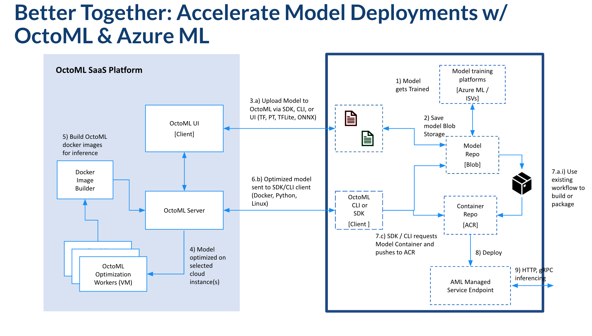

# Introduction
This walkthrough will illustrate how to use the OctoML model-optimization platform with the Azure CLI to deploy a model to an <a href="https://learn.microsoft.com/en-us/azure/machine-learning/concept-endpoints"> Azure ML Managed Endpoint </a> in about 30 minutes. 

The OctoML platform automatically produces a downloadable container with your model that is accelerated, configured, and ready to deploy on the hardware target of your choice. You can <a href="https://octoml.ai/">learn more here.</a> 

# Prerequisites
* <a href="https://learn.microsoft.com/en-us/azure/machine-learning/how-to-configure-cli?tabs=public">The Azure CLI (v2) w/ the Azure ML Extension</a>
* <a href="https://octoml.ai/">OctoML Platform Access</a>
<br>
OR
* The OctoML SDK (platform access token required)
* <a href="https://try.octoml.ai/cli/">Download the OctoML CLI</a>

> **_NOTE:_**  While the CLI is available to everyone, an access token is required to get the full benefits of OctoML's model optimization stack. Learn more about the CLI here. 

## Deploy an Optimized Model to an Azure ML Managed Endpoint

</img>

### 1. Upload and Optimize a Model
From the Explore UI page, upload a model in an ONNX, Pytorch, Tensorflow, or SciKit model format. Click the Explore button to continue to the model optimization workflow settings page.

### 2. Explore Cloud Cost Savings
* In the next page, select the hardware targets you would like to explore potential performance and cost savings. 
* Click run. In the background, the OctoML ML Compiler stack will run a sweep of optimization strategies and benchmark the results on real, production hardware. 
* Return to the Explore UI to see the results. Typically the "best" model package is the one with the lowest overall cost profile and the highest requests-per-second. However, we've designed the constraints UI to optimize around other SLA considerations, such as latency and throughput.

### 3. Package a Model for Production Serving
* Click on one of the benchmarking results to expand the packaging UI. 

* Download the docker tarball artifact to the same directory as the `azure_deploy.sh` script. 

### 4. Deploy a Model Using the Azure CLI w/ the ML Extension
Provided as a shortcut, the `azureml_deploy.sh` will create the AML hosted endpoint and model deployment. The script leans heavily on the Azure CLI+ML Extension to orchestrate resource and service creation and management. 

 * Update the environment variables at the top of the file to reflect your Azure / AML resource names. 
 ```bash 
# Set parameters

BASE_PATH=$PWD
ENDPOINT_NAME=<your-endpoint-name> # e.g. my-octoml-service-endpoint
MODEL_NAME=<your-model-name> #e.g. resnet50
TARBALL_NAME=<my-model-package-name> # e.g.resnet50_v2_7.tar.gz
ACR_NAME=<your-acr-registry-name> # e.g. octoml_gtm
RESOURCE_ID=<your-workspace-resource-id> # e.g. octoml_gtm_rg
ACR_IMG_NAME="${ACR_NAME}.azurecr.io/${MODEL_NAME}:latest"

```
 * From the command line, run `bash azureml_deploy.sh`. This process will take appromixately 20 minutes to complete.

### 5. Test the Model Service
Run an inferencing test with `python3 run.py --remote`.